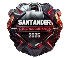

# Santander - Cibersegurança 2025



Bem-vindo ao repositório oficial da minha jornada no **Bootcamp Santander - Cibersegurança 2025** oferecido pela [Digital Innovation One (DIO)](https://www.dio.me/sign-up?ref=AF8WB16042I7). Aqui, você encontrará todos os desafios de código, projetos práticos, mentorias e anotações que desenvolvi ao longo desta formação especializada em cibersegurança.

## Sobre o Bootcamp

O **Bootcamp Santander - Cibersegurança 2025** é um programa avançado que oferece uma imersão completa no universo da segurança digital. Desenvolvido em parceria com o Santander, este bootcamp prepara profissionais para antecipar ameaças e fortalecer a segurança de sistemas através do pensamento estratégico e habilidades essenciais de um hacker ético.

### Detalhes do Bootcamp

- **Área**: Cibersegurança e Ethical Hacking
- **Pré-requisitos**: Conhecimentos básicos em tecnologia e segurança da informação
- **Duração**: Variável, conforme o ritmo de aprendizado
- **Certificado**: Disponível após a conclusão de todas as atividades
- **Data de início**: 29 de setembro (para participantes aprovadas)

### O que você vai aprender?

- **Pensamento estratégico de hackers**: Compreenda a mentalidade por trás das ameaças cibernéticas
- **Identificação de vulnerabilidades**: Aprenda a detectar e analisar falhas em sistemas
- **Técnicas de testes de invasão**: Domine as práticas de pentesting profissionais
- **Engenharia social**: Entenda como funcionam as manipulações psicológicas no contexto digital
- **Deep web e anonimato digital**: Explore os fundamentos do anonimato e funcionamento da deep web
- **Hacking ético**: Aplique técnicas de segurança de forma legal e profissional

## Estrutura do Repositório

O repositório está organizado da seguinte forma:

- **[/desafios_codigo](/challenges_code/)**: Contém todos os desafios de código propostos durante o bootcamp
- **[/projetos](/projects/)**: Aqui estão os projetos práticos desenvolvidos ao longo do curso

## 📥 Downloads dos Sistemas Operacionais

### Sistemas para Laboratório de Pentesting

| Sistema | Versão | Download | Observações |
|---------|--------|----------|-------------|
| **Kali Linux** | 2024.3 | [Download Oficial](https://www.kali.org/get-kali/#kali-platforms) | Distribuição principal para testes de segurança |
| **Metasploitable** | 2 | [Download SourceForge](https://sourceforge.net/projects/metasploitable/files/Metasploitable2/) | VM vulnerável para práticas |
| **Windows 10** | 22H2 | [Download Microsoft](https://www.microsoft.com/software-download/windows10) | Versão de avaliação disponível |
| **Windows XP** | Professional | [Archive.org](https://archive.org/download/WinXPProSP3PortugueseBrazilian/) | Para testes legados |

### 🔧 Configuração do Ambiente Virtual

```bash
# Exemplo de configuração no VirtualBox
# Rede: Host-only
# Memória: 2-4GB por VM
# Armazenamento: 20-40GB por sistema
```

## Atividades do Bootcamp

### 🎯 Mentorias (Live)
Momento para se inspirar nos talentos das empresas mais inovadoras, com interação em tempo real e oportunidades para fazer perguntas sobre carreira e tecnologia.

### 💻 Desafio de Código
Coloque em prática todo o conhecimento adquirido nas aulas e teste suas habilidades na resolução de desafios técnicos.

### 🚀 Desafio de Projeto
Construa seu portfólio desenvolvendo projetos práticos com o conhecimento adquirido ao longo das aulas.

### 🏆 Ranking
Participe do ranking exclusivo do bootcamp, onde você pontua através de:
- Interações no Fórum e Rooms
- Acertos em questionários
- Qualidade do código desenvolvido nos desafios

## Ferramentas de Aprendizado

Durante o bootcamp, utilizei diversas ferramentas e recursos oferecidos pela DIO para aprimorar meu aprendizado:

- **Fórum**: Espaço para interagir com a comunidade e tirar dúvidas técnicas
- **Rooms**: Ambiente para networking com outros participantes do bootcamp
- **Matriculados**: Lista de participantes que estão na mesma jornada educacional
- **Certificado**: Disponibilizado após a conclusão de cada módulo e do bootcamp como um todo

## ⚠️ Avisos Importantes

### Licenciamento de Software
- **Sistemas Windows**: Requerem licenças válidas para uso legal
- **Kali Linux**: Distribuição gratuita e de código aberto
- **Metasploitable**: Desenvolvido para fins educacionais

### Ambiente Controlado
Todos os testes e práticas devem ser realizados em:
- ✅ Ambiente laboratorial isolado
- ✅ Máquinas virtuais dedicadas
- ✅ Rede interna sem internet
- ❌ Nunca em sistemas de produção

## Processo de Seleção

**Importante**: Este bootcamp conta com etapas específicas:
1. **Inscrição**: Realizada pelo site da Open Academy
2. **Aprovação**: Processo seletivo realizado pelo Santander
3. **Liberação**: Acesso concedido no dia 29 de setembro para as participantes aprovadas

## Precisa de Ajuda?

Caso tenha alguma dúvida ou precise de suporte, você pode:

- Acessar a [Central de Ajuda da DIO](https://help.dio.me/)
- Entrar em contato com o suporte da DIO através do link disponível na plataforma
- Consultar a documentação oficial das ferramentas utilizadas

## 📞 Contato

**Vamos fortalecer a segurança digital!** 🔒🚀

---

*Repositório educativo - Desenvolvido para fins de aprendizado em cibersegurança*